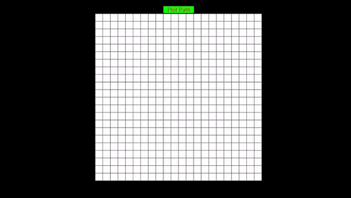

# Path Planning OpenGL Animation
## A* Search Animation


## How to use
### OpenGL Installation
- [Ubuntu / Debian](https://www.includehelp.com/linux/how-to-install-opengl-in-ubuntu-linux.aspx)
- [Windows](https://youtu.be/8p76pJsUP44
)
### Clone this repository
```bash
git clone https://github.com/YashKSahu/Path-Planning-OpenGL-Visualization.git
```
### Compile and Run
```
cd Path-Planning-OpenGL-Animation/src
file=render.cpp
g++ $file -lGL -lGLU -lglut -lGLEW
```

## Resources and References
- [khronos.org/OpenGL](https://registry.khronos.org/OpenGL-Refpages/gl4/)